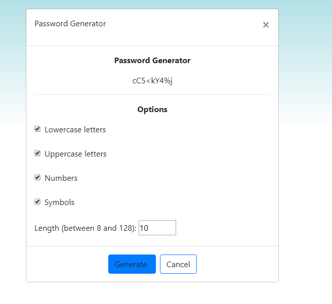

# Homework3

A password generator that will create a random string of numbers, symbols, and letters and output them to the user.

The user can select a length from 8-128 and select which characters they will use to generate the password.

